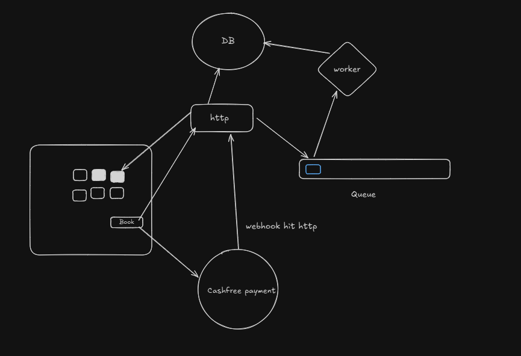
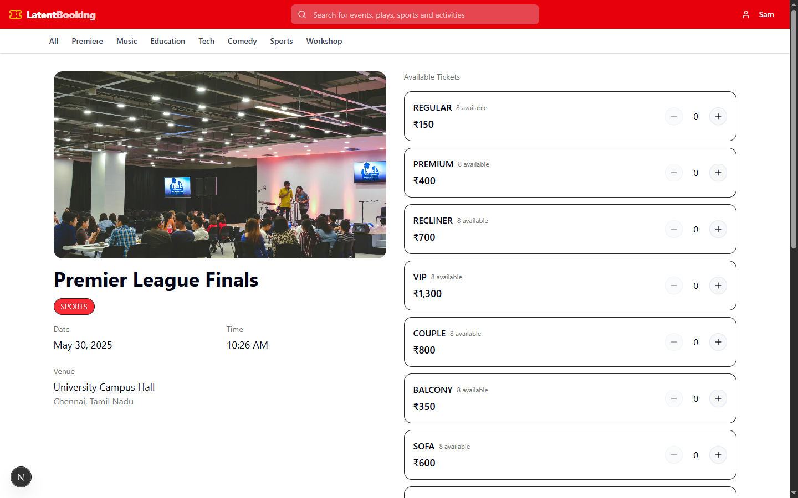

# 🏨 LatentBooking

LatentBooking is a modern **event ticket booking platform** built with a modular architecture. It features a robust backend, a user-friendly frontend, and an asynchronous worker service for handling background tasks like ticket confirmation and notifications.

---

## 🧱 Architecture

---

## 🛠️ Tech Stack

- **Monorepo Management**: [Turborepo](https://turbo.build/repo)
- **Frontend**: [Next.js](https://nextjs.org/), [Tailwind CSS](https://tailwindcss.com/)
- **Backend**: [Express.js](https://expressjs.com/)
- **Queue**: [Redis](https://redis.io/)
- **Worker**: Node.js (Worker Service using Redis queue)
- **Payments**: [Cashfree Payments](https://www.cashfree.com/)

---

## 🌐 Live Demo

🔗 [Latent Booking Demo](https://www.youtube.com/watch?v=vDQEOZ6gNqY)  

---